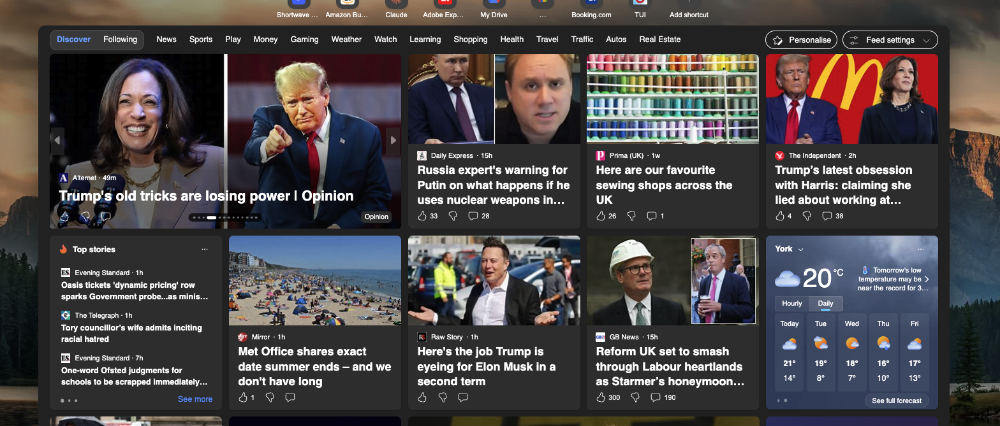

# UI for a newsfeed

This is a UI for a newsfeed. It includes the weather in the current location and the ability to choose a tab for different news stories.
Please make several blocks to recreate this type of thing; the tab headings come from the newsfeed json, along with the image, title, and article.
The code should be able to detect the user's current geolocation. Provide 5 examples of topics and 5 news articles.

When Creating blocks, remember to provide sample JSON and csv files using Franklin's guidance for these files.
