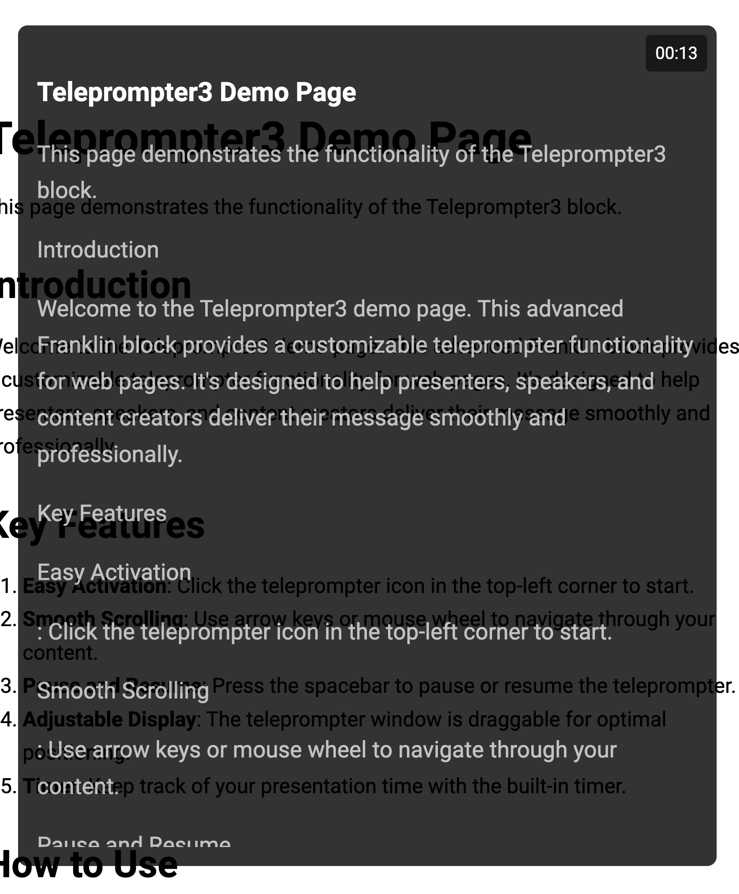

# Enhanced Teleprompter Block (Version 4)

## Generic Info

My name is Tom Cranstoun, I am an AEM Consultant, my Company is Digital Domain Technologies Ltd

## AI Prompt, (c) Tom Cranstoun, September 2024, V 4.0

**Goal:** Create an advanced Franklin block named "teleprompter4" with the following functionalities and improvements.

## Initial State

* Display a clickable icon on the page when the document loads
* The teleprompter4 block should be hidden until the icon is clicked
* Icon design:
  * Use an SVG icon representing a teleprompter
  * Position: Fixed, top left corner of the viewport
  * Size: 24px
  * Cursor: Pointer
  * Z-index: 1001 to ensure visibility
  * Background: Semi-transparent black
  * Color: White
  * Padding and border-radius for better visibility

## Content Processing

* Read all text content in the DOM in the main or body element, ignore meta elements in the page
* Store each text node's content as a separate line in an array called `allLines`
* Filter out empty lines

## Display

* Background: Semi-transparent black (rgba(0, 0, 0, 0.8))
* Dimensions: 80% width, max-width 800px, height 80vh
* Position: Fixed, centered on screen when activated
* Text Display:
  * Font: 24px (base), white color
  * Alignment: Left-aligned
  * Current Line:
    * Font: 28px, bold
    * Displayed at the top
  * Next Lines:
    * Display up to 10 next lines
    * Opacity: 0.7 (slightly dimmed)
* Timer:
  * Position: Top right corner
  * Format: Minutes and seconds (MM:SS)
  * Font: 18px
  * Background: Semi-transparent black

## Scrolling Mechanism

* Scroll direction: Bottom to top (new lines appear at the bottom)
* Triggers:
  * Mouse wheel
  * Arrow keys (Up/Down/Left/Right)
* Prevent default scrolling behavior of the page

## Control Mechanisms

* Start:
  * Click on the teleprompter icon
* Stop:
  * Press the "Esc" key
  * Hides the teleprompter and shows the icon again
* Pause/Resume:
  * Press the spacebar
  * Display "PAUSED" message when paused
  * Timer stops counting when paused

## Draggable Functionality

* Make the entire teleprompter draggable
* Use the teleprompter background as the drag handle
* Exclude the text content area from initiating drag

## Styling

* Cursor:
  * 'default' for text content area
* User selection:
  * Enabled for text content

## Performance

* Ensure smooth scrolling and dragging with minimal impact on page performance
* Use setInterval for timer updates

## Accessibility

* Make the teleprompter focusable (tabindex="0")
* Ensure all keyboard controls are fully functional
* Add aria labels to the icon for screen readers

## Additional Features

* Handle empty content gracefully
* Prevent text from being cut off by using overflow-y: auto

## Icon Management

* Create the icon dynamically in JavaScript using SVG
* Remove the icon from the DOM when the teleprompter is active
* Recreate the icon when the teleprompter is closed

## Error Handling

* Display a message if no content is available for the teleprompter

## Scroll Lock

* Disable background page scrolling when the teleprompter is active
* Re-enable scrolling when the teleprompter is closed

## Timer Functionality

* Implement pause functionality for the timer
* Track total paused time to ensure accurate timing

## Demo Page

Generate a demo markdown page in Franklin format in demos folder, with a title, the block, and sample text about the history of the teleprompter. Place the metadata table at the end, do not use sections '---'
