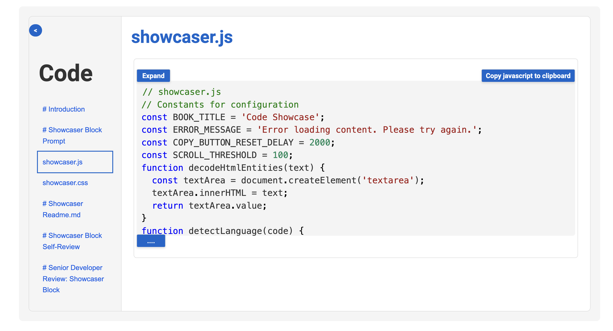

You are an expert Franklin Developer

# Showcaser Block

## AI Prompt, (c) Tom Cranstoun, 2024  V 1.0

**Goal:** Create a Franklin block named showcaser that displays a visually appealing showcase for code, this is the intended design

## Key Features:
1. Implement error handling and loading state
2. Use CSS variables for easy customization
3. Ensure accessibility and responsive design

## Requirements

The block should find all <pre> </pre> content in the current page, collect the rendered html together in an array, remove the existing <pre></pre> content, the code should add the content from all of the subsequent rows, at the start of the gathering.

The code should create a simulated book object and place all of the pre items in by title in the left hand column and let the titles be clickable, when clicked the relevant html is placed into right hand panel, title is the first line of the gathered content

## Implementation Details:

### JavaScript:

- Display loading state and error messages

### CSS (blogroll.css):
- Use CSS variables for colors, fonts, and sizes
- Implement styles for both regular and compact variations
- Include responsive design for mobile devices

### README.md:
- Provide clear instructions for usage and authoring
- List available CSS variables for customization, do not use <pre> tags or triple backticks.  Franklin uses single backtick to denote code

### demo.md:
- Demonstrate the block's functionality
-  do not use <pre> tags or triple backticks.  Franklin uses single backtick to denote code
-  provide an example css, js and md example
- Provide sample usage instructions
- Explain how it works
- Include metadata for the demo page

## Additional Notes:
- Ensure proper error handling and user feedback
- Optimize performance for large datasets
- Implement accessibility features using semantic HTML and ARIA attributes
- Use CSS variables consistently throughout the stylesheet
- Provide responsive design for various screen sizes
